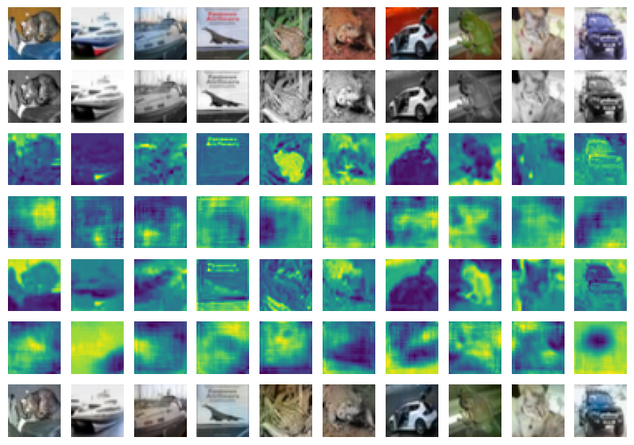

# Image-Colorization

This project is an extension of the colorization problem solved as part of
UMass COMPSCI 689 course I took in Fall 2023.

## Data

The data for this problem as of yet is private and currently not hosted anywhere. Will post a drive link for it soon

## Best model

Project best model

The best model so far can be found [here](https://drive.google.com/drive/folders/1rlGLuCpsZlYiOBUryiUNCTkfDUBtfFTw?usp=drive_link)

The above models performs very well on the training set but gives poor performance for the test set. It works well with images with neutral colored objects such as "plane with a blue sky backdrop" but underperforms in many other generic settings.

## Results

Project results - this section here is for describing the results of the different models and ablation studies.

| Sr.No | Model | Parameters | Accuracy | Validation Loss | Test Loss | Remarks |
| ----- | ----- | ---------- | -------- | ---- | ----- | ------- |
| 1 | Conv-Net | lr: 0.00008, batch_size: 64, num_epochs: 150 | NA |  0.0684 | 0.0952 | Batch size 64 performed better for training set |

## Best Model Results

